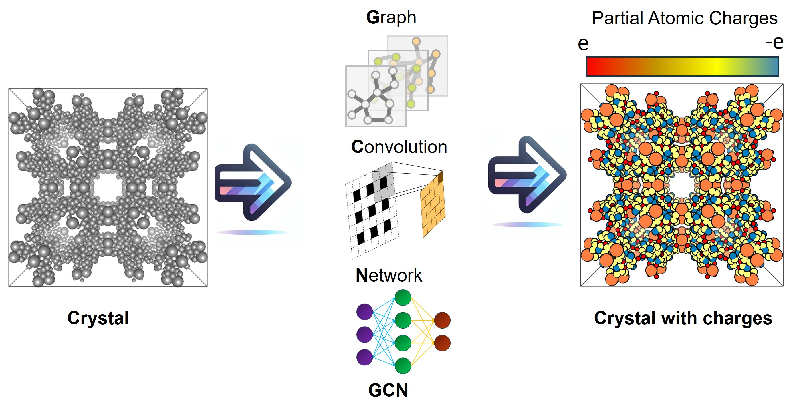

<h1 align="center">GCN Charge</h1>

<h4 align="center">

</h4>              

A MOF/COF charge predicter by **G**raph **C**onvolution **N**etwork.                           

[](https://python.org/downloads) [](https://doi.org/10.5281/zenodo.123456)  [](https://github.com/sxm13/GCNCharges/LICENSE.txt) [](mailto:sxmzhaogb@gmail.com) []() []()          
                      

# Download

```sh
git clone https://github.com/sxm13/GCNCharges.git
```   

# Installation

```sh
pip install -r requirements.txt
```

# Charge Assignment               
You can put your cif files in any folder, but please run the code and jupyter notebook in this folder.                

**bash**
```sh
python GCNCharge.py [folder name] [MOF/COF]
```
example: ```python GCNCharge.py test_file MOF```

**notebook**
```sh
import GCNCharge4notebook
GCNCharge4notebook.GCNChagre(file="./test/test_cubtc/",model="MOF")
```
file: your folder contains cif files                               
model: MOF or COF                                                   
there is an example in ```GCNCharge.ipynb```

# Website & Zenodo
IF you do not want to install GCN Charge, you can go to this :point_right: [link](https://gcn-charge-predicter-mtap.streamlit.app/)       
IF you want to DOWNLOAD full code and dataset, you can go to this :point_right: [link](https://zenodo.org/records/)             

# Reference
If you use CGCN Charge, please cite [this paper]():
```bib
@article{,
    title={},
    DOI={},
    journal={},
    author={},
    year={},
    pages={}
}
```

## Development & Bugs

 If you encounter any problem during using ***GCN Charge***, please talk to me ```sxmzhaogb@gmail.com```.                   

 
### Overall workflow


# Structure of repository
```
.
├── ..
├── figs                                                # Figures used for introduction 
│   ├── toc.jpg                                         # Table of Contents
│   ├── workflow.png                                    # Workflow of this project
│
├── model                                               # python files used for dataset prepartion & GCN training
│   ├── GCN_E.py                                        # Networks model for energy/bandgap training
│   ├── GCN_ddec.py                                     # Networks model for atomic charge training
│   ├── cif2data.py                                     # convert cif [QMOF](https://github.com/Andrew-S-Rosen/QMOF) to dataset
│   ├── data_E.py                                       # Loads in datalist from [./data_handling.py]. Split it into training, validation and testing dataset. Uses [./charge_prediction_system] for training the model [./model.py] and tests it
│   ├── data_ddec.py                                    # Notebook for main.py
│   └── utils.py                                        # Contains results from the MPNN
│
├── embedding_visualization                             # Element Embedding visualizations
│   └── Embedding_Visualization.ipynb                   # Notebook for element embedding visualization. Utilizes UMAP, t-SNE and PCA
│
├── deployment                                          # Code for deployment dataset, where MPNN charges are assigned to the CoRE v2{2} dataset
│   ├── data_handling.py                                # Reads in graph information from [../build_graphs/deployment_graphs[A/F]SR] and generates a data list
│   ├── deployment_main.py                              # Main file for reading the graphs, loading the model and generating charge predictions for deployment sets
│   ├── deployment_main.ipynb                           # Notebook for deployment_main.py
│   ├── model.py                                        # Required by [./deployment_main.py/ipynb] to load the trained model [./models_deployment.pt]  
│   └── results                                         # Results of charge predictions for the deployment sets
│       └── predictions                                 # Charge predictions
│           ├── deployment_graphs_ASR                   # - for CoRE_v2_ASR
│           └── deployment_graphs_FSR                   # - for CoRE_v2_FSR
│
├── Charge_Assigned_CoRE_MOFs                           # CoRE v2 structures with MPNN charges assigned to them
│   ├── MPNN_CoRE-ASR.tar.gz                            # - CoRE v2 ASR (All Solvents Removed) structures with MPNN charges
│   └── MPNN_CoRE-FSR.tar.gz                            # - CoRE v2 FSR (Free Solvents Removed) structures with MPNN charges
│
└── adsorption_simulations                              # Adsorption simulation details for Henry coefficients
    ├── analyze_henry.ipynb                             # - Notebook that analyzes results stored in simulation results directory
    ├── run_henry.jl                                    # - The Julia script which runs the Henry coefficients
    ├── run_henry.sh                                    # - 
    ├── submit_henry.sh                                 # - Two files used to submit Adsorption calculations to a cluster
    ├── iqeq_xtals                                      # - Crystals (from a test set in one of our MPNN runs) with I-QEq charges assigned
    ├── mpnn_xtals                                      # - Crystals (from a test set in one of our MPNN runs) with MPNN charges assigned
    ├── ddec_xtals                                      # - Crystals (from a test set in one of our MPNN runs) with DDEC charges assigned
    └── simulations.tar.gz                              # - Simulations results stored in a tarball.
```

 
**Group:**   [Molecular Thermodynamics & Advance Processes Laboratory](https://sites.google.com/view/mtap-lab/home?authuser=0)                                
